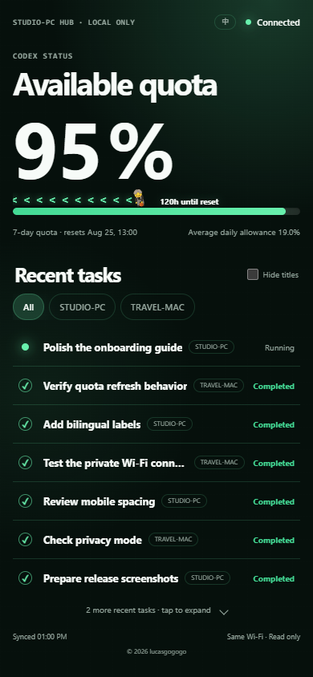
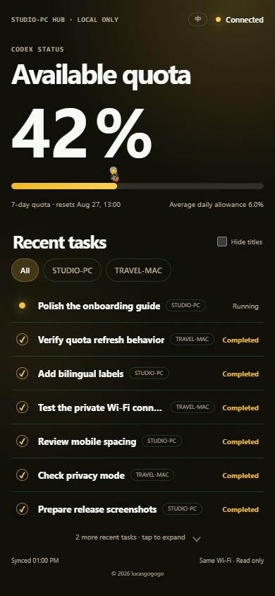
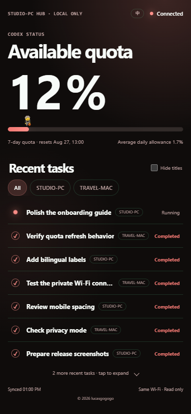
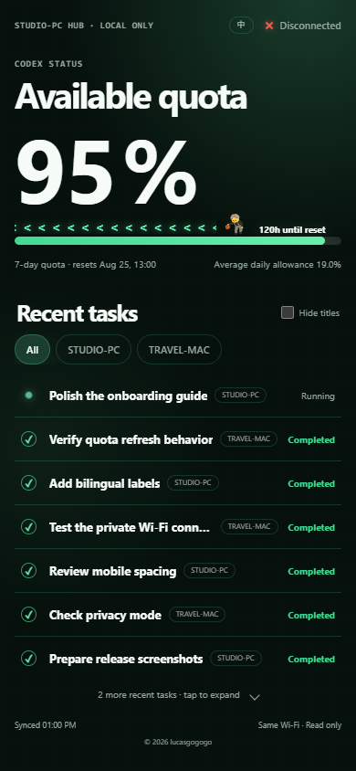

# Codex Phone Dashboard

[中文说明](./README.zh-CN.md) · English


Turn a spare phone into a private, read-only Codex status screen. It shows your available quota, reset time, average daily allowance, recent task states, and optional activity from another computer—only while the phone and host computer share the same trusted Wi-Fi.

## Phone dashboard preview

| Connected · 95% | Warning · 42% |
|---|---|
|  |  |

| Danger · 12% | Disconnected |
|---|---|
|  |  |

The screenshots are generated from the real 390×844 page with synthetic computer names and task titles. No private task data is included.

## What it does

- Uses Safari or any modern phone browser; no iOS/Android app is required.
- Makes available quota the main visual, with green (50%+), yellow (15–49.9%), and pale red (below 15%) themes.
- Keeps the quota fill tied only to remaining quota, while the basketball mascot moves toward reset time with full-length left arrows and a countdown placed directly behind it.
- Shows seven recent tasks, with an expandable remainder list.
- Keeps running tasks first; a newly completed task moves directly below them and flashes once.
- Uses actual computer names in compact filter pills.
- Supports complete Chinese and English UI.
- Protects the first connection with a six-digit code on shared Wi-Fi, then keeps that phone paired across computer restarts and Dashboard updates.
- Optionally reads another computer through an existing key-based SSH connection; remote monitoring is off by default.

## Privacy and safety

- The server accepts only loopback and private-LAN clients.
- It does not expose prompts, replies, reasoning, tool arguments, project paths, raw rollout files, account IDs, or task/session IDs.
- It is read-only: the phone cannot start, stop, approve, or modify Codex tasks.
- Do not use public hosting, port forwarding, a reverse proxy, or a tunnel.
- Task titles are visible by default. Enable **Hide titles** on the phone when needed.

## Requirements

- Windows 11 or macOS
- [Node.js 20 or newer](https://nodejs.org/en/download)
- Codex installed and signed in on the host computer
- Phone and computer on the same trusted Wi-Fi

## Beginner installation

### 1. Download the project

Open a terminal in the folder where you want to keep the dashboard, then clone this repository:

```text
git clone https://github.com/lucasgogogo/codex-phone-dashboard.git
cd codex-phone-dashboard
```

If you downloaded the ZIP instead, extract it to a permanent folder and open a terminal in that folder. Do not move the folder after enabling automatic startup.

### 2A. Windows

Open **Windows PowerShell as Administrator**, change to the repository folder, and run:

```powershell
powershell -ExecutionPolicy Bypass -File .\scripts\install-windows.ps1
```

The installer runs the tests, creates one inbound rule limited to TCP 43117 and `LocalSubnet`, and adds a current-user logon task. It prints the private URL and pairing code when ready.

The Dashboard generates the code locally. The AI installing it can read the code; if it was not shown, ask: “What is my Codex Phone Dashboard pairing code?”

Useful controls:

```powershell
.\scripts\configure-startup-task.ps1 -Action Status
.\scripts\configure-startup-task.ps1 -Action Restart
.\scripts\configure-startup-task.ps1 -Action Stop
.\scripts\configure-startup-task.ps1 -Action Remove
.\scripts\configure-windows-firewall.ps1 -Remove
```

After the normal background installation, ask your AI to run `scripts/reset-paired-devices.ps1` to revoke every paired phone. It confirms the exact server process has stopped before rotating local authorization and restarting, without deleting tasks or configuration. `npm start` is diagnostic-only and does not provide automated revocation.

### 2B. macOS

Open Terminal, change to the repository folder, and run:

```sh
chmod +x scripts/install-macos.sh scripts/configure-startup-macos.sh
./scripts/install-macos.sh
```

The installer runs the tests and creates a current-user LaunchAgent at `~/Library/LaunchAgents/com.lucasgogogo.codex-phone-dashboard.plist`. It does not install a root daemon.

Useful controls:

```sh
./scripts/configure-startup-macos.sh status
./scripts/configure-startup-macos.sh restart
./scripts/configure-startup-macos.sh stop
./scripts/configure-startup-macos.sh remove
```

After the normal LaunchAgent installation, ask your AI to run `sh scripts/reset-paired-devices.sh` to revoke every paired phone. `npm start` is diagnostic-only and does not provide automated revocation.

### 3. Connect the phone

1. Keep the phone and computer on the same trusted Wi-Fi.
2. Read the private URL and six-digit code provided by the AI on your computer. If no code was shown, ask: “What is my Codex Phone Dashboard pairing code?”
3. Open the URL in Safari or another modern browser.
4. Enter the code within 10 minutes.
5. Use the `EN / 中` button to change language.

Upgrading from a version earlier than `v1.2.0` requires one final pairing. After that, computer restarts and Dashboard updates—including `v1.3.0`—do not require the code again unless Safari website data is cleared or paired devices are explicitly revoked.

## Let an AI install it

Copy the prompt below into Codex, ChatGPT, Claude, or another coding assistant that can access your computer:

```text
Install the Codex Phone Dashboard from https://github.com/lucasgogogo/codex-phone-dashboard on this computer.

Before changing anything:
1. Detect whether this is Windows or macOS.
2. Explain every file, firewall, login-startup, SSH, or Git change you propose.
3. Ask me for approval before any firewall, startup, SSH, or Git mutation.

Then:
- Install it in a permanent English-only path chosen with me.
- Confirm Node.js 20+ and Codex are available.
- Run npm install and npm test.
- Default to this computer only; do not configure a remote computer unless I explicitly request it.
- Use the repository's matching Windows or macOS installer.
- Keep it private to the same trusted Wi-Fi. Never use public hosting, port forwarding, reverse proxies, or tunnels.
- Verify the process, TCP 43117 listener, local HTTP page, runtime status, and pairing code separately.
- Give me the exact private URL and six-digit pairing code. Tell me that if no code is visible later, I can ask my AI for it, then wait while I test it on my phone.
- If anything fails, report the proven failure and rollback path. Do not claim success from a scheduler entry alone.
```

Codex users can also install the repository skill and invoke `$codex-phone-dashboard`. A Codex skill is a directory with a required `SKILL.md` and optional supporting resources, and can be invoked explicitly or matched from its description; see [OpenAI's official skill guide](https://learn.chatgpt.com/docs/build-skills).

## Maintainer release workflow

Maintainers can publish a GitHub Release from the background after completing GitHub CLI authorization once. The release helper fails closed unless the working tree is clean, the current branch is `main`, local `HEAD` exactly matches `origin/main`, `package.json` matches the requested version, and the remote tag resolves to that same commit.

Read-only validation of an existing or release-ready tag:

```powershell
.\scripts\publish-release.ps1 -Version v1.3.0 -ValidateOnly
```

Publishing a new, already-pushed tag requires the explicit `-Publish` switch and a release-notes file:

```powershell
.\scripts\publish-release.ps1 -Version v1.4.0 -Publish -NotesFile .\release-notes-v1.4.0.md
```

The helper refuses duplicate Releases and uses GitHub CLI's `--verify-tag`, `--latest`, and `--notes-file` safeguards. See the official [`gh auth login`](https://cli.github.com/manual/gh_auth_login) and [`gh release create`](https://cli.github.com/manual/gh_release_create) documentation.

## Optional remote computer

Remote monitoring is disabled unless `CODEX_PHONE_REMOTE_SSH_HOST` is set. It requires an existing key-based SSH connection and a usable Codex CLI on the remote computer.

Copy `config.example.json` to `config.local.json`, then edit only the values you need:

- `remoteSshHost`: SSH alias or hostname.
- `remoteCodexBin`: remote Codex executable; default is `codex`.
- `remoteLabel`: optional display label; otherwise the remote hostname is used.

Windows:

```powershell
Copy-Item .\config.example.json .\config.local.json
# Open config.local.json, replace the empty remoteSshHost with your SSH alias, save it, then:
.\scripts\configure-startup-task.ps1 -Action Restart
```

macOS:

```sh
cp config.example.json config.local.json
# Open config.local.json, replace the empty remoteSshHost with your SSH alias, save it, then:
./scripts/configure-startup-macos.sh restart
```

`config.local.json` is ignored by Git. A remote outage does not stop local quota or local task activity. Delete the local file and restart to disable remote monitoring. Environment variables with the `CODEX_PHONE_REMOTE_` prefix remain available as an advanced override.

## Verification status

- Windows 11: automated tests and the local background flow are verified on the development computer.
- 390×844 phone UI: Chinese/English, three quota themes, disconnected state, privacy-safe screenshots, no horizontal overflow, and no page errors are automatically checked.
- macOS: the LaunchAgent scripts are syntax-checked and follow Apple's current-user LaunchAgent layout; a real Mac verification is still required before claiming full macOS runtime proof.

Official references: [Apple launchd guide](https://support.apple.com/guide/terminal/script-management-with-launchd-apdc6c1077b-5d5d-4d35-9c19-60f2397b2369/mac), [Microsoft ScheduledTasks](https://learn.microsoft.com/en-us/powershell/module/scheduledtasks/), and [Microsoft New-NetFirewallRule](https://learn.microsoft.com/en-us/powershell/module/netsecurity/new-netfirewallrule).

## Attribution and project contributions

The Codex app-server request/pagination foundation and rollout lifecycle observation are adapted from [BarryBarrywu/codex-zectrix-dashboard](https://github.com/BarryBarrywu/codex-zectrix-dashboard) under the MIT License. The upstream copyright and license are preserved in [LICENSE](./LICENSE) and [THIRD_PARTY_NOTICES.md](./THIRD_PARTY_NOTICES.md).

This independent project adds and rebuilds the product around a phone browser:

- A responsive iPhone/Android web dashboard instead of a hardware-specific display output.
- A Node.js local-LAN service for Windows and macOS, with a shared-Wi-Fi six-digit gate, restart-persistent pairing, and an all-device revocation mechanism.
- A quota-first bilingual interface, three quota themes, seven-task expansion, completion promotion/flash, privacy mode, and real hostname filters.
- Optional read-only monitoring of another computer through an existing key-based SSH connection.
- Windows Task Scheduler and LocalSubnet firewall setup, plus a macOS current-user LaunchAgent.
- Privacy-minimized browser snapshots, automated Node tests, Skill validation, package allowlisting, and eight synthetic-data screenshots.

## License

[MIT](./LICENSE) · [Third-party notices](./THIRD_PARTY_NOTICES.md) · © 2026 [lucasgogogo](https://github.com/lucasgogogo)
