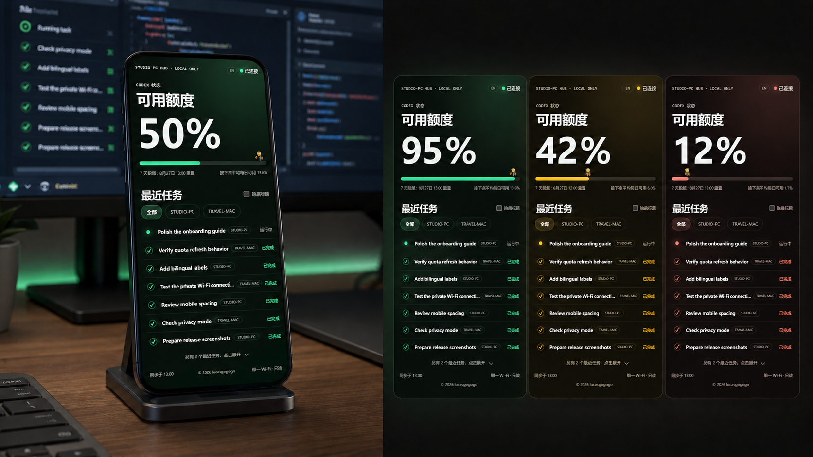
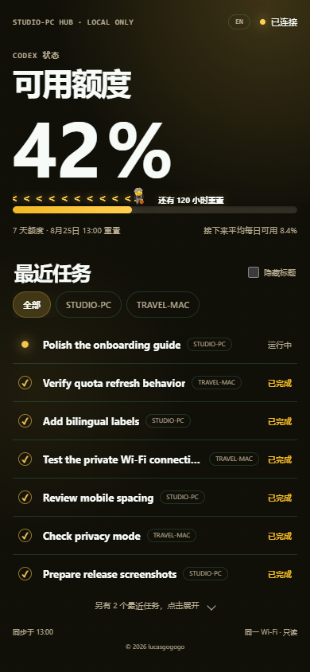
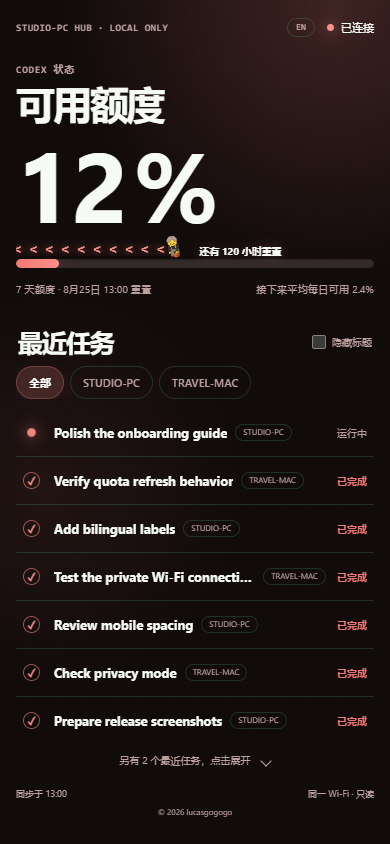
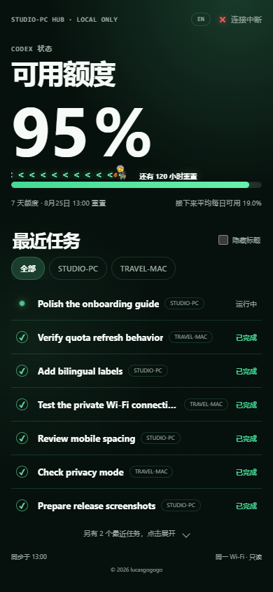

# Codex 手机状态屏

中文 · [English](./README.md)



把备用手机变成一个私密、只读的 Codex 状态屏。只要手机和电脑连接同一个可信 Wi-Fi，就能看到可用额度、重置时间、接下来平均每日可用额度、最近任务状态，以及可选的另一台电脑任务。

## 手机页面预览

| 已连接 · 95% | 黄色提醒 · 42% |
|---|---|
|  |  |

| 淡红提醒 · 12% | 已断开 |
|---|---|
|  |  |

这 8 张中英文截图都来自真实的 390×844 页面，但电脑名和任务名全部是虚构数据，没有包含私人任务。

## 它能做什么

- 手机只需要 Safari 或现代浏览器，不需要下载 iOS/Android App。
- 可用额度是页面主视觉：50% 以上绿色、15%–49.9% 黄色、低于 15% 淡红色。
- 额度条只表示剩余额度；篮球小人按重置时间向左移动，前方箭头铺到最左端，剩余小时文案紧跟在小人后面。
- 默认显示 7 条最近任务，其余任务点击展开。
- 运行中任务始终置顶；新完成任务移动到所有运行中任务之后并闪一下。
- 筛选胶囊显示真实电脑名，不写死“公司电脑/个人电脑”。
- 页面可以完整切换中文和英文。
- 共享 Wi-Fi 下首次连接使用 6 位配对码；配对成功后，这台手机会跨电脑重启和 Dashboard 更新保持登录。
- 可以通过已经存在的 SSH 密钥连接读取另一台电脑；默认不开启远端监控。

## 隐私和安全边界

- 服务只接受本机和私有局域网访问。
- 不会发送 prompt、回复、推理、工具参数、项目路径、原始 rollout、账户 ID、任务 ID 或会话 ID。
- 手机只能看，不能启动、停止、批准或修改 Codex 任务。
- 不要配置公网部署、端口转发、反向代理或 tunnel。
- 任务标题默认可见；需要时可在手机页面打开“隐藏标题”。

## 安装要求

- Windows 11 或 macOS
- [Node.js 20 或更高版本](https://nodejs.org/en/download)
- 电脑已经安装并登录 Codex
- 手机与电脑连接同一个可信 Wi-Fi

## 小白安装教程

### 第 1 步：下载项目

在你准备长期保存本项目的文件夹打开终端，然后运行：

```text
git clone https://github.com/lucasgogogo/codex-phone-dashboard.git
cd codex-phone-dashboard
```

如果下载的是 ZIP，把它完整解压到一个长期不移动的文件夹，再在这个文件夹打开终端。开启自动启动后不要再移动项目目录。

### 第 2A 步：Windows 安装

右键 Windows PowerShell，选择“以管理员身份运行”，进入项目目录后运行：

```powershell
powershell -ExecutionPolicy Bypass -File .\scripts\install-windows.ps1
```

安装器会运行测试、创建一个仅允许 TCP 43117 和 `LocalSubnet` 的入站规则，并建立当前用户登录启动任务。完成后会显示手机要打开的私有地址和 6 位配对码。

配对码由 Dashboard 在电脑本地生成。安装你的 AI 可以读取它；如果安装结果里没有看到，直接问 AI：“我的 Codex Phone Dashboard 配对码是多少？”

常用控制：

```powershell
.\scripts\configure-startup-task.ps1 -Action Status
.\scripts\configure-startup-task.ps1 -Action Restart
.\scripts\configure-startup-task.ps1 -Action Stop
.\scripts\configure-startup-task.ps1 -Action Remove
.\scripts\configure-windows-firewall.ps1 -Remove
```

使用正式后台安装后，需要让所有已配对手机失效时，让 AI 运行 `scripts/reset-paired-devices.ps1`。它会确认精确服务进程已经停止，再轮换本机授权并重启服务，不会删除任务或配置。`npm start` 只用于前台诊断，不提供自动撤销流程。

### 第 2B 步：macOS 安装

打开“终端”，进入项目目录后运行：

```sh
chmod +x scripts/install-macos.sh scripts/configure-startup-macos.sh
./scripts/install-macos.sh
```

安装器会运行测试，并在 `~/Library/LaunchAgents/com.lucasgogogo.codex-phone-dashboard.plist` 创建当前用户的后台启动项，不会安装 root daemon。

常用控制：

```sh
./scripts/configure-startup-macos.sh status
./scripts/configure-startup-macos.sh restart
./scripts/configure-startup-macos.sh stop
./scripts/configure-startup-macos.sh remove
```

使用正式 LaunchAgent 安装后，需要让所有已配对手机失效时，让 AI 运行 `sh scripts/reset-paired-devices.sh`。`npm start` 只用于前台诊断，不提供自动撤销流程。

### 第 3 步：连接手机

1. 确认手机和电脑连接同一个可信 Wi-Fi。
2. 从电脑端 AI 给出的安装结果里找到私有网址和 6 位配对码；如果没有看到，直接问 AI：“我的 Codex Phone Dashboard 配对码是多少？”
3. 在手机 Safari 打开这个网址。
4. 在 10 分钟内输入配对码。
5. 用右上角的 `EN / 中` 切换页面语言。

从低于 `v1.2.0` 的版本升级时需要最后配对一次。之后只要不清除 Safari 网站数据、也不主动撤销设备，包括升级到 `v1.3.0` 在内的电脑重启或 Dashboard 更新都不需要重新输入。

## 让 AI 自动帮你安装

把下面整段提示词复制给能够操作你电脑的 Codex、ChatGPT、Claude 或其他编程 AI：

```text
请在这台电脑安装这个项目：https://github.com/lucasgogogo/codex-phone-dashboard

开始修改前：
1. 先判断当前是 Windows 还是 macOS。
2. 先用中文解释准备修改哪些文件、防火墙、登录启动、SSH 或 Git 状态。
3. 防火墙、自动启动、SSH 或 Git 的任何修改，都必须先单独问我，等我明确回复 ok。

然后：
- 和我确认一个长期使用、只包含英文字符的安装路径。
- 检查 Node.js 20+ 和 Codex 是否可用。
- 在仓库根目录运行 npm install 和 npm test。
- 默认只读取当前电脑；除非我明确要求，否则不要配置远端电脑。
- 按系统使用仓库自带的 Windows 或 macOS 安装脚本。
- 只允许同一个可信 Wi-Fi 访问，绝不配置公网、端口转发、反向代理或 tunnel。
- 分别验证 Node 进程、TCP 43117 监听、本机 HTTP 页面、runtime 状态文件和配对码。
- 最后把手机要打开的私有网址和 6 位配对码明确发给我；告诉我“如果以后没看到配对码，直接问 AI 要”，然后等我用手机测试。
- 如果失败，告诉我已经实测确认的失败原因和回滚方法；不能只看到计划任务或 LaunchAgent 就说安装成功。
```

Codex 用户还可以安装仓库里的 Skill，然后调用 `$codex-phone-dashboard`。OpenAI 官方说明：Skill 是包含必需 `SKILL.md` 和可选资源的目录，可以显式调用，也可以按 description 自动匹配；参见 [OpenAI Skill 官方说明](https://learn.chatgpt.com/docs/build-skills)。

## 可选：显示另一台电脑

只有设置 `CODEX_PHONE_REMOTE_SSH_HOST` 后，远端监控才会启用。它要求两台电脑之间已经配置好免交互 SSH 密钥，并且远端电脑能运行 Codex CLI。

先把 `config.example.json` 复制成 `config.local.json`，然后只改需要的值：

- `remoteSshHost`：SSH alias 或主机名。
- `remoteCodexBin`：远端 Codex 可执行文件，默认是 `codex`。
- `remoteLabel`：可选显示名称；不填就使用远端 hostname。

Windows：

```powershell
Copy-Item .\config.example.json .\config.local.json
# 打开 config.local.json，把空白的 remoteSshHost 换成你的 SSH alias，保存后运行：
.\scripts\configure-startup-task.ps1 -Action Restart
```

macOS：

```sh
cp config.example.json config.local.json
# 打开 config.local.json，把空白的 remoteSshHost 换成你的 SSH alias，保存后运行：
./scripts/configure-startup-macos.sh restart
```

`config.local.json` 已被 Git 忽略。远端断线只会把该来源标记为不可用，不影响当前电脑的额度和任务。需要关闭远端时，删除本地配置文件并重启。高级用户仍可使用 `CODEX_PHONE_REMOTE_` 前缀的环境变量覆盖配置。

## 当前验证状态

- Windows 11：自动测试和本机后台运行流程已经在开发电脑验证。
- 390×844 手机页面：中英文、三档额度颜色、断线状态、隐私截图、无横向溢出和无页面错误均有自动检查。
- macOS：LaunchAgent 脚本已完成语法/静态检查，并按 Apple 当前用户 LaunchAgent 目录设计；在真正 Mac 上跑完前，不声称 macOS 已完成实机验证。

官方资料：[Apple launchd 指南](https://support.apple.com/guide/terminal/script-management-with-launchd-apdc6c1077b-5d5d-4d35-9c19-60f2397b2369/mac)、[Microsoft ScheduledTasks](https://learn.microsoft.com/en-us/powershell/module/scheduledtasks/) 和 [Microsoft New-NetFirewallRule](https://learn.microsoft.com/en-us/powershell/module/netsecurity/new-netfirewallrule)。

## 来源署名与本项目贡献

Codex app-server 请求与分页基础、rollout 生命周期读取逻辑改编自 MIT License 项目 [BarryBarrywu/codex-zectrix-dashboard](https://github.com/BarryBarrywu/codex-zectrix-dashboard)。原作者的著作权和许可文本完整保留在 [LICENSE](./LICENSE) 与 [THIRD_PARTY_NOTICES.md](./THIRD_PARTY_NOTICES.md)。

本独立项目围绕手机浏览器新增和重做了以下部分：

- 把硬件专用输出改造成适配 iPhone/Android 的响应式网页状态屏。
- 新增 Windows/macOS 可运行的 Node.js 局域网服务、共享 Wi-Fi 六位码保护、跨重启持久配对与全部设备撤销机制。
- 新增额度优先的中英文界面、三档额度主题、7 条任务展开、完成置顶闪光、隐私模式和真实设备名筛选。
- 新增通过既有 SSH 密钥只读监控另一台电脑的可选能力。
- 新增 Windows Task Scheduler、LocalSubnet 防火墙配置和 macOS 当前用户 LaunchAgent。
- 新增浏览器隐私裁剪、Node 自动测试、Skill 校验、公开包白名单以及 8 张虚构数据截图。

## License

[MIT](./LICENSE) · [第三方来源说明](./THIRD_PARTY_NOTICES.md) · © 2026 [lucasgogogo](https://github.com/lucasgogogo)
